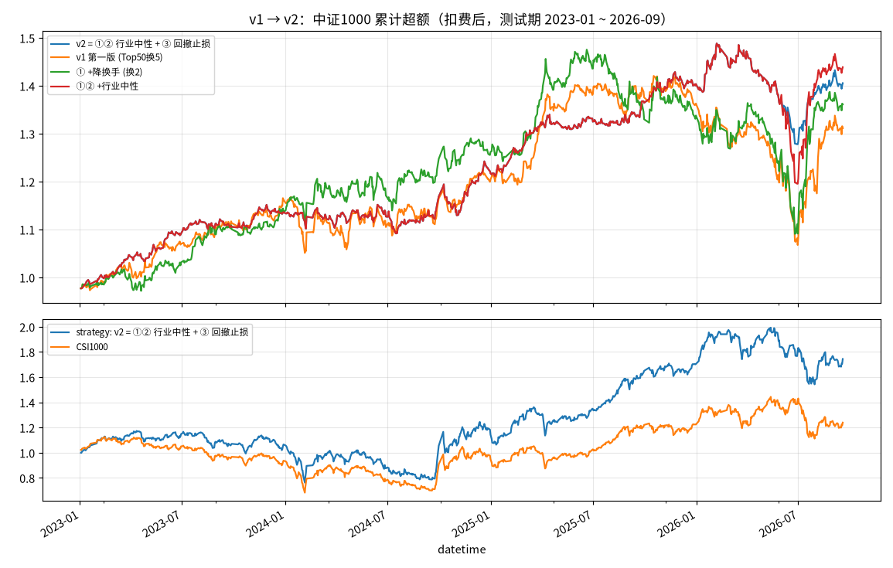

# retail_alpha：站在散户对面的 A 股量化策略（v2）

> 在中证1000小盘股里，用 16 个"散户行为偏差"因子 + LightGBM 选股。
> v1 以微软 Qlib 官方基线为骨架；v2 按优化路线图做完了**一、二、三优先**全部实验。
> 数据截至 2026-09-28；测试期 2023-01 ~ 2026-09 为**样本外**（训练 2015-2020，验证 2021-2022）。

## 👉 可直接使用的策略：[`strategies/`](strategies/README.md)

研究的最终结论整理成了两个可实盘的策略，包含回测复现和每日调仓清单生成：

| 策略 | 持股 / 换仓 | 研究期 2023-26 超额 / 信息比率 | 样本外 2020-22 超额 / 信息比率 |
|---|---|---|---|
| **A_top50**（主策略） | 50 只 / 每天换 2 只 | 9.3% / 1.24 | 16.4% / 2.01 |
| A_top20（进取版） | 20 只 / 每天换 1 只 | 12.1% / 1.22 | 15.6% / 1.49 |

```bash
bash setup_env.sh && source env.sh
python strategies/backtest.py                                   # 复现回测
python strategies/live.py signal --strategy A_top50             # 生成下一交易日的调仓清单
```

下面是完整的研究报告（v1 → v2 → 候选对比 → 稳健性检验）。

---

## 0. 一页总结



| | 超额年化 | 信息比率 | 超额最大回撤 | 日均换手 | 超额年化（+千1滑点） |
|---|---|---|---|---|---|
| **v1** 第一版 | 7.8% | 0.67 | -27.8% | 19.1% | 2.9% |
| **v2** 降换手 + 行业中性 + 回撤止损 | **9.3%** | **1.24** | **-15.1%** | **7.8%** | **6.3%** |
| v2 保守版（再加市值中性） | 7.1% | 1.10 | **-12.6%** | 7.6% | 4.8% |

超额 = 相对中证1000，已扣手续费（买万5、卖千1、每笔最低5元）。按真实涨跌停幅度、一手100股回测。

v2 分年超额：2023 **+13.6%**｜2024 **+7.1%**｜2025 **+15.3%**｜2026 年初至今 **+0.1%**

**最大的提升不是更高的收益，而是更稳**：信息比率几乎翻倍，回撤减半，对滑点的承受力也强了很多。

---

## 1. 先说三件"反直觉"但最重要的事

1. **3.7 年的测试期，超额年化的统计误差大约 ±6%。** 同一个模型换个随机种子重训一次，回测就能差 2~3 个百分点。所以本报告更看重**信息比率、回撤、分年一致性**这类指标，而不是只看年化收益这一个数字。
2. **"数据看起来是新的"不等于"信息是新的"。** 换手率、涨停细节、龙虎榜单独拿出来都是很强的因子（ICIR 最高 -0.59，11 年每年都有效），但加进模型之后几乎没有增量，因为散户的行为已经体现在价格和成交量里了。
3. **涨停股是回测陷阱。** 模型会学会"追连板"：训练标签里连板股收益很高，但涨停时买不进，实际能买到的都是没封住板的。v2 的训练标签剔除了"次日买不进"的样本。

---

## 2. 第一优先：解决 v1 暴露的问题

### ① 降换手（`output/p1/turnover.csv`）

| 方案 | 超额年化 | 信息比率 | 日均换手 | +千1滑点 |
|---|---|---|---|---|
| v1：日频 Top50，每天换5只 | 7.8% | 0.67 | 19.1% | 2.9% |
| 日频 Top30，每天换2只 | 7.9% | 0.59 | 12.8% | 4.7% |
| **日频 Top50，每天换2只** ✅ | **8.9%** | **0.72** | **7.8%** | **6.2%** |
| 周频 Top50（5日标签，缓冲2.0） | 3.8% | 0.32 | 16.7% | 0.2% |
| 双周 Top50（5日标签） | 2.6% | 0.22 | 11.8% | -0.6% |

**结论：周频调仓反而更差，换手也降不下来。** 这些散户因子的信号衰减很快，一周后排名基本全换了。正确做法是每天调仓但少换几只。

### ② Alpha158 与散户因子合并（`output/p1/features.csv`）

| 模型 | RankIC | 超额年化 | 信息比率 | 超额回撤 | 2025 | 2026 |
|---|---|---|---|---|---|---|
| Alpha158（Qlib 官方基线） | 0.027 | 7.9% | 0.81 | **-14.6%** | 3.9% | **22.5%** |
| 散户 16 因子 | **0.040** | 8.9% | 0.72 | -29.1% | 6.0% | 1.7% |
| 合并训练（174 个因子） | 0.035 | 3.4% | 0.34 | -24.6% | -8.5% | 15.1% |
| 两个策略各用一半资金 | — | 7.9% | **0.80** | -23.1% | 3.2% | 8.2% |

- 两组因子合并训练效果最差（因子太多，信号被稀释）
- 两套策略赚钱的年份互补（日超额相关性 0.6），**分成两个账户各跑一半资金**的效果比混在一个模型里好

### ③ 拥挤度监控和控仓（`output/p1/crowding_retail_h1.csv`）

三条规则都是事先定好的，参数没有用测试期数据调过。触发时把一半的超额暴露换成中证1000 ETF 或期货。

| 规则 | 超额年化 | 信息比率 | 超额回撤 |
|---|---|---|---|
| 不控仓 | 8.9% | 0.72 | -29.1% |
| R1 因子失效（近60日 IC < 0） | 8.4% | 0.70 | -28.0% |
| R2 小盘过热（中证1000/沪深300 成交额比，z > 1.5） | 7.7% | 0.63 | -29.3% |
| **R3 超额回撤止损（>8% 降半仓，回到 -4% 以内恢复）** ✅ | 8.1% | **0.83** | **-20.9%** |

**只有 R3 有效。** 看起来很聪明的"因子失效"和"小盘过热"信号都没用，这里如实记录。

---

## 3. 第二优先：加入更多散户数据（`output/p2/`）

新增 13 个因子：换手率 5 个（来源 baostock），涨停细节 6 个（从日线计算），龙虎榜 3 个（来源东方财富，2015-2026 共 20 万条）。

**单因子检验（2016-2026，未来 5 日收益）：**

| 因子 | RankIC | ICIR | 含义 |
|---|---|---|---|
| LIMUP20 | -0.051 | **-0.59** | 近20日涨停次数越多，之后越跑输（11年每年都成立） |
| LHB20 | -0.049 | **-0.59** | 近20日上龙虎榜次数越多，之后越跑输（每年都成立） |
| TURNVOL | -0.041 | -0.55 | 换手率忽高忽低，之后跑输 |
| ZHABAN20 | -0.034 | -0.48 | 炸板次数越多越差 |
| LHB_GAP | +0.048 | +0.46 | 距离上次上龙虎榜越久越好 |
| LHB_NET20 | -0.011 | -0.24 | **游资净买入之后反而略微跑输**，跟着游资买在统计上不成立 |

**但是进了模型几乎没有增量**（`output/p2/lhb_model.csv`：三个版本 RankIC 都是 0.035）。原因见 `factor_overlap.csv`：

| 新因子 | 已有因子 | 截面秩相关 |
|---|---|---|
| TURNVOL 换手波动 | VOLVOL20 成交量波动 | **-0.99**（本质是同一个东西，流通股本在比值里约掉了） |
| LIMUP20 涨停次数 | BIGUP20 大涨次数 | -0.83 |
| ABTURN 异常换手 | ABVOL5 异常放量 | -0.82 |
| LHB20 上榜次数 | LIMUP20 涨停次数 | 0.61 |
| ZHABAN20 炸板 | USHADOW20 上影线 | -0.24（真正新的信息） |

> 我的判断：这几类数据在**择时和风控**上可能比在选股上更有用。比如可以把全市场龙虎榜的游资活跃度当作情绪指标，这个我还没做。

---

## 4. 第三优先：模型与组合（`output/p3/models.csv`）

| 方案 | RankIC | RankICIR | 超额年化 | 信息比率 | 超额回撤 |
|---|---|---|---|---|---|
| 基准：LightGBM 静态训练 | 0.040 | 0.27 | 8.9% | 0.72 | -29.1% |
| 每季度滚动重训 | 0.037 | 0.25 | 6.6% | 0.61 | -30.3% |
| XGBoost | 0.039 | 0.26 | 5.8% | 0.47 | -29.3% |
| LightGBM 排序目标 | **0.049** | 0.35 | 4.1% | 0.25 | -39.3% |
| 3 个随机种子集成 | 0.041 | 0.28 | 6.5% | 0.52 | -32.3% |
| **+ 行业中性** ✅ | 0.036 | 0.34 | **10.0%** | **1.14** | -21.6% |
| **+ 行业 + 市值中性** ✅ | 0.036 | **0.38** | 7.8% | 1.08 | **-16.4%** |

- **中性化是这一轮最大的提升**：打分和市值的相关性从 -0.27 降到 -0.05，剩下的收益更接近真正的 alpha
- 滚动重训在 2025~2026 年反而拖后腿。早停机制在最后几个窗口只保留了 1 棵树，因为验证集里规律变了；现在已改成固定 100 棵树
- 排序目标的 RankIC 最高，但前 50 名选得最差："整体排得准"不等于"头部选得准"
- RD-Agent（用大模型自动挖因子）需要大模型 API 密钥，这次没有做

---

## 5. 如何使用

```bash
bash setup_env.sh --alpha158      # Python 3.11 环境 + 数据 + 面板 + 散户/Alpha158 因子
source env.sh
bash run_all.sh                   # 一键复现全部研究实验（首次约 2~3 小时，大部分时间在下载换手率/龙虎榜）
```

2GB 内存就能跑完，包括 174 个因子的合并模型。引擎按块读写磁盘，训练集可以隔日抽样。

**实盘**：见 [`strategies/README.md`](strategies/README.md)。`strategies/live.py` 把"更新数据 → 打分 → 行业中性 → Top50 换 2 只 → R3 风控"整合成了一条命令。

## 6. 目录

| 路径 | 内容 |
|---|---|
| `engine/panel.py` | 行情面板：按板块计算真实涨跌停、停牌、次日能否买入、标签 |
| `engine/features.py` | 分块计算 Qlib 表达式因子（散户 16 个 / Alpha158）并落盘 |
| `engine/extra_features.py` | 换手率、涨停细节、龙虎榜因子 |
| `engine/model.py` | 省内存训练：LightGBM / XGBoost / 排序目标，支持静态或滚动训练 |
| `engine/backtest.py` | A 股回测器：TopkDropout 或周期调仓、一手100股、最低5元佣金、控仓叠加 |
| `data_fetch/` | baostock 换手率/ST/行业、龙虎榜下载（断点续传） |
| `experiments/` | p1_turnover / p1_crowding / p2_factor_ic / neutralize / compare / final / candidates / topk / h_robust |
| `output/final/` | **v1 与 v2 对比总表、净值图、v2 逐日收益** |
| `output/p1~p3/` | 各优先级的实验结果（CSV + 图） |
| `output/v1/` | 第一版（Qlib 流水线）结果 |
| `strategies/` | **可实盘的两个策略（A_top50 / A_top20）：配置、每日信号、回测复现** |
| `models/` | 生产模型 |
| `setup_env.sh`, `env.sh` | 环境与数据一键准备 / 路径配置 |
| `run_model.py`, `factor_ic.py` | v1 的 Qlib 原生脚本（需要 8GB 以上内存才能跑 Alpha158） |

## 7. 回测口径说明（和 v1 数字不同的原因）

v1 用 Qlib 回测得到 11.6%，同一个策略在 v2 回测器里是 7.8%。差异来自：
- Qlib 把"涨跌幅 ≥ 9.5%"一律视为涨跌停，创业板和科创板因此被误伤，约影响 +0.7%
- 模型随机性：v2 引擎重新训练的模型和 v1 的略有不同，约影响 3%，这在统计误差范围内

另外，一手 100 股的限制本身对结果影响约 +1%（两边都有这个限制）。100 万资金分到 50 只股票后买不起高价股，等于隐性偏向低价股；资金改成 1000 万，这部分收益就消失了。

v2 的口径更接近实盘，所以 v1 和 v2 的对比全部在 v2 回测器里重新计算。

## 8. 下一步可以做的

- 两账户组合：Alpha158 + 中性化散户策略，分账户各一半资金
- 把龙虎榜和涨停数据用来做**择时**：全市场情绪指标，决定超额暴露
- 用分钟数据研究集合竞价和尾盘行为
- 至少用小资金实盘 3~6 个月，对比实盘和回测的差距，重点看滑点

> 免责声明：仅供学习研究，不构成投资建议。历史回测不代表未来收益。

---

## 9. 候选策略横向对比（`output/candidates/`）

统一口径：Top50 每日换2、R3 回撤止损、100 万账户。前半/后半 IR = 2023-2024 / 2025-2026 分别计算的信息比率。

| 候选 | 超额年化 | 信息比率 | 超额回撤 | 前半IR | 后半IR | +千1滑点 |
|---|---|---|---|---|---|---|
| **A 散户·行业中性（v2）** | 9.3% | 1.24 | -15.1% | 1.42 | 1.07 | 6.3% |
| B 散户·行业+市值中性（v2保守） | 7.1% | 1.10 | -12.6% | 1.67 | 0.60 | 4.8% |
| C 散户·行业中性·可成交标签 | 7.2% | 1.04 | -14.1% | 0.81 | 1.25 | 4.8% |
| D 散户+换手涨停龙虎榜·行业中性 | 5.4% | 0.73 | -12.6% | 0.57 | 0.89 | 4.0% |
| E Alpha158（官方基线） | 5.5% | 0.64 | -11.8% | 0.11 | 1.15 | 3.4% |
| F Alpha158·行业中性 | 3.6% | 0.49 | -21.7% | 1.27 | -0.49 | 2.7% |
| G 双账户：A + F 各50万 | 8.1% | **1.33** | -13.4% | **2.13** | 0.55 | 6.3% |
| **H 单账户：A 与 F 打分平均** | **10.8%** | 1.31 | -15.5% | 1.36 | **1.24** | **8.9%** |

- A 和 F 的日超额相关只有 0.29，所以 F 单独很弱，但作为"分散器"有价值
- H 是在看过前面所有结果之后才构造的，存在**多重检验偏差**。未中性化的同类混合（第2节）只有 5.1%，说明这个结论对细节很敏感

---

## 10. H 的稳健性检验 + 持股数量（`output/h_robust/`、`output/topk/`）

### 10.1 H 的样本外检验：没通过
新模型用 2015–2018 训练、2019 验证，在 **2020–2022**（从未参与任何选择）上重跑整套方案（行业中性 + R3 + 50/2）：

| 方案 | 超额年化 | 信息比率 | 超额回撤 | +千1滑点 | 2020 | 2021 | 2022 |
|---|---|---|---|---|---|---|---|
| v1 散户·不中性 | 11.2% | 1.22 | -11.0% | 9.1% | 3.6% | 6.5% | 26.0% |
| **A 散户·行业中性 (v2)** | **16.4%** | **2.01** | **-7.1%** | **14.9%** | 7.5% | 20.9% | 25.7% |
| E Alpha158 官方基线 | 9.5% | 0.99 | -10.6% | 6.6% | 6.4% | 7.3% | 15.5% |
| F Alpha158·行业中性 | 7.4% | 0.95 | -12.0% | 5.1% | 12.2% | -0.6% | 11.2% |
| G 双账户 A+F | 11.9% | 1.67 | -8.5% | 11.3% | 10.4% | 8.2% | 19.4% |
| H 打分平均 A+F | 9.5% | 1.21 | -10.4% | 7.7% | 5.7% | 7.5% | 16.6% |

- 样本外权重扫描（散户 1.0→0.3）：16.4 / 9.2 / 12.1 / 13.1 / 13.8 / 9.5 / 10.6 / 10.4%，**纯散户最好**
- 2023–26 的权重扫描是锯齿形（9.3 / 12.4 / 10.8 / 9.3 / 11.6 / 10.8…），相邻权重之间的差别就是噪音
- 结论：**H 在 2023–26 的优势是选择偏差，不能复现**。行业中性化（A 相对 v1）在样本外被确认有效

### 10.2 持股数量：50–100 最好，≤10 不可取
2023–26，含 R3，100 万账户，同换手口径（日均约 4–9%）：

| 持股 | A 超额 / IR | H 超额 / IR | 样本外 2020–22 A 超额 / IR |
|---|---|---|---|
| 200 | 6.4% / 0.85 | 7.1% / 0.91 | — |
| 100 | 8.8% / **1.33** | 9.3% / 1.26 | 13.1% / 1.80 |
| **50** | 9.3% / 1.24 | 10.8% / 1.31 | **16.4% / 2.01** |
| 30 | 9.6% / 1.11 | 10.5% / 1.26 | 13.1% / 1.36 |
| 20 | 12.1% / 1.22 | 7.7% / 0.80 | 15.6% / 1.49 |
| 10 | 10.9% / 0.84 | 13.8% / 1.10 | **-3.5% / -0.36** |
| 5 | 4.4% / 0.32 | 3.7% / 0.25 | 0.4% / 0.04 |

原因见 `output/topk/rank_buckets.csv`：排名前 5 的股票次日超额并不比 21–50 名高（A 为 -2.6bp），但波动是后者的 2 倍。模型真正稳定的信号是"避开最差的 500 名以后"（t=-3.1），而不是"精准挑出最好的几只"。集中持股只会放大噪音。

---

## 11. 能不能提高收益？（`output/boost/`、`output/strategy_b/`）

范围：只在中证1000内，围绕"散户一直在犯的错"。所有方案都在**研究期 2023-26** 和**样本外 2020-22**（从未参与选择）两段上回测，含 R3，扣费。

### 11.1 优化原策略 A

| 方案 | 研究期超额 / IR | 样本外超额 / IR | 结论 |
|---|---|---|---|
| **0 基线 A_top50（50只/每天换2）** | 9.3% / 1.24 | 16.4% / 2.01 | — |
| 1 去掉 R3 | 10.0% / 1.14 | 16.4% / 2.01 | 多 0.7%，但超额回撤 -15% → -22% |
| 2 多周期融合（1日+5日标签） | 7.3% / 0.96 | — | ✗ |
| 3a 开盘成交（原模型） | 10.6% / 1.43 | 14.0% / 1.78 | 两段方向相反，不可靠 |
| 3b 开盘成交 + 开盘标签重训 | 4.4% / 0.66 | 11.6% / 1.44 | ✗ |
| 5 融资杠杆 1.3 倍 | 12.9% / 1.06 | 21.5% / 1.92 | 只是放大：策略回撤 -35% → -44% |
| 6 加 12 个"长期犯错"因子 | 8.9% / 1.23 | 15.2% / 1.93 | 没有增量 |
| 6+3a 新因子 + 开盘成交 | 10.6% / 1.46 | 14.6% / 1.88 | 两段方向相反 |
| 集成（A + 新因子模型）Top50 | 9.2% / 1.19 | 16.8% / 2.09 | 持平 |
| 集成（A + 新因子模型）Top20 | 11.8% / 1.17 | 26.9% / 2.43 | 研究期不如 A_top20（12.1%），样本外大幅领先，**不稳定** |
| 每天换 3 只（50/3） | 10.0% / 1.28 | 17.9% / 2.18 | 加千1滑点后只多 0.7% / 0.2%，千2 滑点后反而更差 |

### 11.2 新增的 12 个"散户长期犯错"因子（`retail_factors.BEHAVIOR_FACTORS`，`output/boost/behavior_ic.csv`）

单因子都很强，11 年每年都有效：ATTN60（60 日反复爆量）行业中性 ICIR 0.50，与原因子最大相关仅 0.33；ABVOL250 0.48；EXTREME60 0.40；UPVOL20 0.36；LOW250 0.31。CGO60（浮盈）方向与"处置效应"理论相反：浮盈越大后面越差（散户追涨而不是急着卖）。HIGH250（锚定一年高点）无效。
**但加进模型后没有增量**：模型已经从 20 日窗口的量价里学到了这些信息。

### 11.3 新策略 B：纯规则"反散户"组合（`experiments/strategy_b.py`）

只用 2016-2019 数据挑出 19 个稳定因子，等权合成 → 行业中性 → 与 A 相同的交易规则：

| | 研究期超额 / IR | 样本外超额 / IR |
|---|---|---|
| B 规则 Top50 | 1.4% / 0.15 | 9.6% / 1.00 |
| A+B 打分平均 Top50 | 6.3% / 0.79 | 17.8% / 1.97 |

远不如 A。**A 的收益来自机器学习捕捉的因子交互**（例如"放量 + 暴涨"同时出现时散户的错最大），线性加总做不到。

### 11.4 结论

1. **A 已经处在一个平台上**：持股 30–50 只、每天换 2–3 只、有没有新因子、尾盘还是开盘，差别都在 ±1–2% 以内。
2. **±1–2% 本身就是噪音**：同一策略只因滑点不同导致一手取整不同，后续持仓路径就会变，年化相差 1–2%（例如 20/1 在样本外，加千1滑点反而从 15.6% 变成 16.7%）。小于 2% 的"改进"在 3–4 年回测里无法分辨。
3. **能确定提高收益的只有承担更多风险**：去掉 R3（+0.7%，回撤更大）、集中到 Top20（弹性更大、更依赖运气）、加杠杆（线性放大收益和回撤）。
4. **用量价数据描述的散户错误已经被挖得差不多了**。要真正提高收益，需要量价之外、直接记录散户行为的数据：股东户数变化（散户涌入）、融资余额变化（散户加杠杆）、个股人气排名或股吧热度（注意力）。
