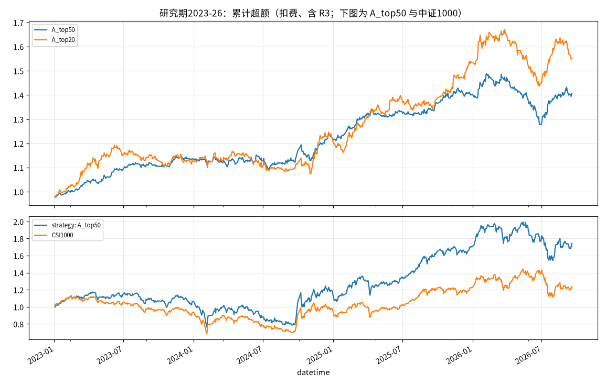
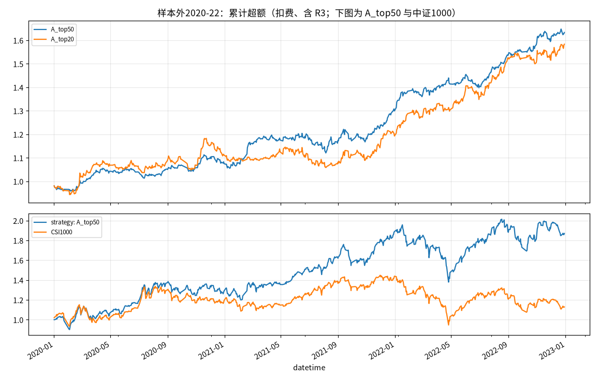

# 策略 A：站在散户对面（A_top50 / A_top20）

> 在中证1000成分股里，用 16 个"散户行为偏差"因子 + LightGBM 打分，做**行业中性**后选分数最高的股票，
> 每天少量换仓，并用 R3 规则在策略失效期自动降仓。
> 研究过程、所有失败的尝试和原因见仓库根目录的 [README](../README.md)。

**⚠ 免责声明：本仓库仅供学习研究，不构成任何投资建议。历史回测不代表未来收益，实盘可能亏损。**

---

## 1. 两个版本

| | **A_top50（主策略）** | **A_top20（进取版）** |
|---|---|---|
| 持股数 | 50 只，等权 | 20 只，等权 |
| 换仓 | 每天卖出排名最差的 2 只、买入 2 只 | 每天卖 1 只、买 1 只 |
| 日均换手 | 约 7.8% | 约 9.8% |
| 适合资金 | 50 万 ~ 300 万 | 30 万 ~ 200 万 |
| 特点 | 分散、稳健，信息比率更高 | 收益弹性更大，但单票风险和回撤更大，结果更依赖运气 |

共同规则：

- **股票池**：中证1000（按历史成分，避免幸存者偏差）
- **因子**：`retail_factors.py` 中的 16 个散户行为因子（彩票偏好 MAX20、短期反转 REV5、异常放量 ABVOL5、尾盘偏离 CLOSEVWAP、流动性 AMIHUD20 等）
- **模型**：LightGBM（强正则化），预测"次日尾盘买入、持有 1 天"的收益；训练时剔除次日涨停/停牌买不进的样本
- **行业中性**：每天把打分转成排名，再减去所属证监会行业的平均排名，避免押注单一行业
- **成交**：T 日收盘后出信号，**T+1 日尾盘集合竞价（14:57–15:00）成交**；涨停买不进的用替补，跌停卖不出的继续持有、第二天再卖
- **R3 风控**：策略相对中证1000的超额收益从高点回撤超过 **8%** 时，一半仓位换成中证1000ETF；回撤收窄到 **4%** 以内恢复满仓
- **费用**：买入万5、卖出千1（含印花税），每笔最低 5 元；按一手 100 股（科创板 200 股）取整

参数都在 [`config.py`](config.py) 里。

## 2. 回测表现

两段检验，所有数字都已扣除费用，并包含 R3 风控：

- **研究期 2023-01 ~ 2026-09**：模型用 2015–2020 训练、2021–2022 早停。所有方案都是在这段区间上比较选出来的，**数字偏乐观**。
- **样本外 2020-01 ~ 2022-12**：模型用 2015–2018 训练、2019 早停。**这 3 年没有参与任何方案选择**，更能反映真实水平。

| 区间 | 策略 | 超额年化 | 信息比率 | 超额回撤 | 策略年化 | 策略回撤 | 基准年化 | 月胜率 | +千1滑点后超额 |
|---|---|---|---|---|---|---|---|---|---|
| 研究期 | **A_top50** | 9.3% | **1.24** | -15.1% | 15.8% | -35.0% | 5.8% | 58% | 6.3% |
| 研究期 | A_top20 | **12.1%** | 1.22 | -14.9% | **18.7%** | -40.1% | 5.8% | 51% | **7.6%** |
| 样本外 | **A_top50** | **16.4%** | **2.01** | **-7.1%** | **22.7%** | -29.5% | 4.0% | **69%** | 14.9% |
| 样本外 | A_top20 | 15.6% | 1.49 | -10.8% | 21.3% | -29.1% | 4.0% | 53% | **16.8%** |

分年超额（相对中证1000）：

| 年份 | 2020 | 2021 | 2022 | 2023 | 2024 | 2025 | 2026（至 9 月） |
|---|---|---|---|---|---|---|---|
| A_top50 | +7.5% | +20.9% | +25.7% | +13.6% | +7.1% | +15.3% | +0.1% |
| A_top20 | +11.1% | +7.3% | +32.8% | +13.0% | +6.8% | +27.1% | +1.2% |




**怎么读这些数字：**

- **这是一个"相对收益"策略**：大盘跌的时候它也会跌（策略回撤 -30% ~ -40%），它赚的是**比中证1000多出来的部分**。
- 3~4 年的回测，超额年化的统计误差大约 **±6%**。所以看信息比率、超额回撤和分年表现是否稳定，比盯着年化数字更可靠。
- **A_top20 的收益并不稳定**：在研究期更高，样本外反而更低；月胜率只有约 50%。收益高度依赖少数几个大月（例如 2025 年 +27%）。
- 2026 年到目前基本打平，年中有一次超额回撤（R3 期间降了仓）。这是**散户因子拥挤**的典型表现。

**为什么不选更少的持股（10 只、5 只）？** 在样本外，持 10 只超额 -3.5%，持 5 只 +0.4%。模型排名前 5 的股票，次日表现并不比 21–50 名好，但波动是后者的 2 倍。这个模型真正的能力是**避开最差的那批股票**，而不是精准挑出最好的几只。详见根目录 README 第 10 节。

## 3. 快速开始

```bash
git clone <your-repo-url> && cd retail_alpha
bash setup_env.sh                 # 建 Python 3.11 环境、下载 Qlib 日线数据、行业、面板、因子（约 5 分钟）
source env.sh

python strategies/backtest.py     # 复现上面的回测表格和图（约 30 秒）
```

**依赖：** Python 3.8–3.12（pyqlib 不支持 3.13），2GB 内存，约 3GB 磁盘。数据来自社区维护的 [chenditc/investment_data](https://github.com/chenditc/investment_data)，每个交易日更新；行业分类来自 baostock。

## 4. 实盘流程

### 第一次：训练生产模型

```bash
python strategies/live.py train
```

- **数据窗口**：默认用 2015 年到最近两年之前的数据训练，最近两年做早停，结果保存到 `models/retail_lgb.txt`。
- **重训频率**：建议**每年重训一次**。研究中每季度滚动重训的效果反而更差，因为因子拥挤期早停会失效。
- **自带模型**：仓库里已经附带一个训练好的模型，数据截至 2026-09-28，best_iter=64。它和研究模型的打分秩相关 0.90，2026-06 ~ 09 的 RankIC 为 0.0385，研究模型为 0.0386。

### 每个交易日收盘后（建议 17:00 以后，等数据源更新）

```bash
bash setup_env.sh --refresh       # 下载最新数据，重建面板和因子（约 3 分钟）
python strategies/live.py signal --strategy A_top50 --holdings my_holdings.csv --cash 23000 --etf_value 0
```

`my_holdings.csv` 格式如下（`600000`、`600000.SH`、`SH600000` 三种写法都可以）：

```csv
code,shares
603103,1200
002484.SZ,300
```

第一次建仓时不传 `--holdings`，现金默认用 `config.py` 里的初始资金。

**输出示例**（信号日 2026-09-28，A_top20，模拟一个 90 万的已有账户）：

```
==== A_top20｜信号日 2026-09-28｜在下一交易日尾盘集合竞价成交 ====
账户：股票 874,562 + 现金 30,000 + ETF 0 = 904,562；持仓 19 只 / 目标 20 只
R3：模拟盘超额回撤 -0.0%（阈值 -8% 进 / -4% 出），明日股票仓位 100%

操作      代码     名称      排名  股数   参考价   参考金额  备注
卖出 600519.SH 贵州茅台     -1   100  1243.88  124388  非策略股票，整笔卖出
买入 600773.SH 西藏城投     18  4300     9.29   39947
买入 688206.SH 概伦电子     19  1000    35.39   35390
...
替补（买入目标涨停/停牌买不进时按顺序替换）：002127.SZ 南极电商、300298.SZ 三诺生物 ...
```

清单同时保存到 `strategies/signals/{策略}_{日期}.csv`。这个目录已经加入 `.gitignore`，**不会把你的持仓提交到公开仓库**。

**规则说明：**

| 情况 | 处理 |
|---|---|
| 买入目标在成交日涨停或停牌 | 按顺序用替补名单里的股票 |
| 资金不够买一手（高价股） | 备注"资金不足一手，用替补" |
| 要卖的股票跌停 | 继续持有，第二天的信号会再次要求卖出 |
| 持仓里有非策略股票（不在中证1000或已被调出） | 一次性全部卖出 |
| R3 进入或维持半仓 | 屏幕会提示 ETF 的目标金额，按提示把持仓卖出约一半去买中证1000ETF |
| R3 解除 | 卖出全部 ETF，之后的信号会逐步补足持仓 |

R3 的状态由**同一模型的模拟盘**计算，默认回看最近 365 天，可以用 `--r3_lookback` 调整，所以不需要你自己记录净值。

## 5. 实盘建议与停止条件

- **先小资金试跑 3–6 个月**，每天记录实际成交价与信号参考价的差距（滑点），并对比 `signal` 输出的"模拟盘超额"和你账户的实际超额。
- **合理预期**：扣除真实滑点后，超额 **3–6%/年**。回测数字会被选择偏差、滑点和因子拥挤打折扣。
- **不要加杠杆，除了 R3 之外不要做主观择时。** 这是相对收益策略，牛市熊市都会跟着大盘波动。

**出现以下任一情况，应暂停并复盘：**
1. 实盘平均滑点超过**千2**（超过这个水平，扣完成本后超额基本就没了）
2. 实盘超额回撤超过 **20%**（回测最差约 -15%）
3. **连续两个季度** RankIC 为负（说明散户行为模式变了，或者因子已经太拥挤）

## 6. 已知局限

- **行业分类用的是当前快照**：历史上的行业划分略有不同，存在轻微的前视偏差。
- **容量有限**：中证1000小盘股流动性一般，资金过千万后冲击成本会明显上升。100 万以下的回测还隐含了"一手 100 股导致偏向低价股"的效应，约 +1%/年。
- **因子拥挤**：这类散户因子已被很多私募使用，2026 年的超额基本为 0，需要持续跟踪。
- **数据源依赖**：依赖社区数据集和 baostock，数据延迟或出错会影响当天的信号。

## 7. 文件

| 路径 | 内容 |
|---|---|
| `strategies/config.py` | 两个策略的全部参数 |
| `strategies/live.py` | `train` 训练生产模型 / `signal` 生成每日调仓清单 |
| `strategies/backtest.py` | 复现两段回测 |
| `strategies/results/` | 回测结果：汇总表、分年、分月超额、逐日收益、净值图 |
| `models/retail_lgb.txt` | 生产模型（LightGBM，约 160KB） |
| `output/preds/retail_h1_neu_ind.parquet` | 研究期预测（复现回测用） |
| `output/preds/retail_h1_oos_neu_ind.parquet` | 样本外预测（复现回测用） |
